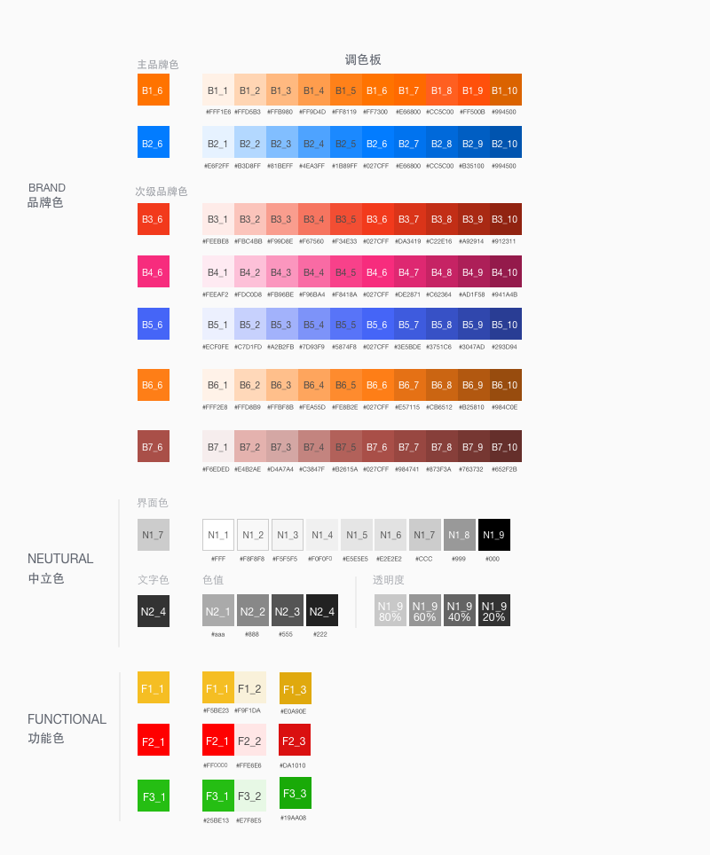
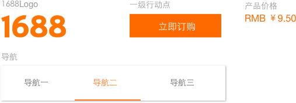
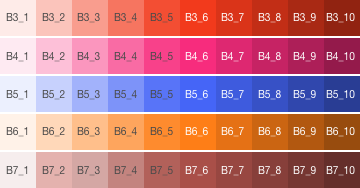
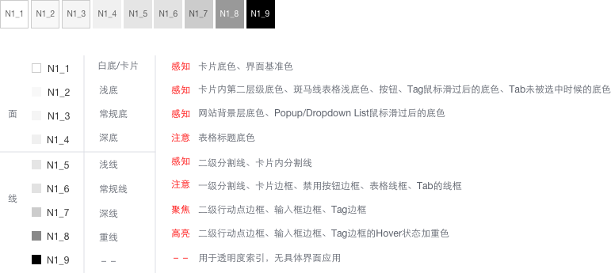
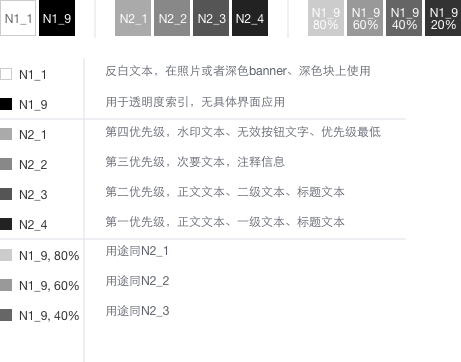

# Color 颜色

## 构成／Component

颜色是指UI界面设计中使用的色彩体系，其中包括：Brand品牌色、Neutural中立色、Functional功能色以及衍生出的UI调色板四个部分。

### 品牌色：

代表品牌对外形象及VI识别。主色的数量根据品牌特性制定，可以1个也可以多个。用于主Button、主搜、价格、ICON等需要突出品牌特征的地方.次级品牌色层级低于品牌，多用与子品牌、子服务、行业等衍生业务，数量≥0。

### 中立色：

灰或饱和度低的颜色（如蓝灰）用与界面设计中背景、边框、分割线、ICON、中立插图等。

### 功能色：

用于UI设计中需要引起注意的设计。如：流程中的进度、提醒、成功等

## **规则/Rule**

1.品牌色、中立色、功能色为颜色的基础框架，UI设计中的任何颜色都要在此框架下产生，调色板中包含设计中的所有颜色。

2.在业务中经常使用的颜色，对其进行编号，垂直、水平可拓展。垂直编号规则：纵向下扩展品牌色数量。主品牌色为B1-6，那么有次品牌色时，使用B2-6，B3-6...依次顺延。水平编号规则：纵横向为色阶数字代号，每个颜色对应一个代号由字母+数字组成。如：主品牌色为B1-6，那么B1-6的Hover色为B1-9，使用其他色阶依次顺延。

3.如果某个颜色增加了透明度，那么默认为新增颜色。只有颜色使用成蒙版时可以用透明度来做。

## 颜色使用说明

### **品牌色/Brand-Color**

### 1.1 主品牌色

  
第一优先级，1688Logo，阿里巴巴平台一级行动点，被选中的Tab，Icon和导航，文字Hover色彩，产品价格色彩。

### 1.2 主品牌色

第二优先级，1688卖家工作台平台一级行动点，被选中的Tab，Icon和导航，文字Hover色彩。

### 2次级品牌色

次级品牌色在色彩级别上弱于橙、蓝两色，在网站上用于调和主品牌色，并为其它需要用到色彩的非首要级别的内容调色。这些内容包括子品牌、服务的图标，运营、插图、数据图谱、带品牌感的界面内容等。

### 中**立色/Neutral-Color**

  
**1.** 界面色

界面色是界面组成**PC**、无线界面的基本色彩，这些颜色规定了线、面、投影、背景等设计要素。

  
2.  文字色

中立字体色主要用于标题、正文、列表等字段。

### 

  

