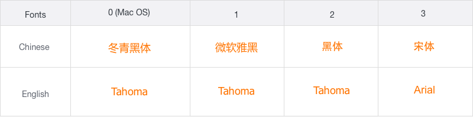
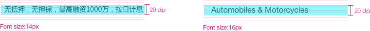
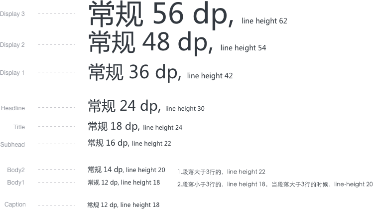
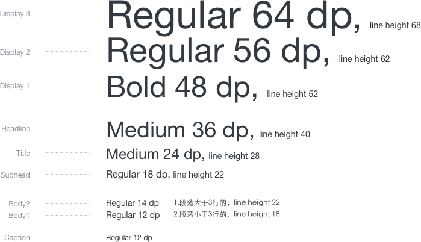

# Font字体

## 定义／**Definition**

设定字体主要解决的是内容可读性以及信息的层级表达，同时选择不同的字体来传达不同的设计风格的统一性和整体性，从而在阅读的舒适性上达到平衡。

## 选择**字体/Choose-Fonts **

从公司通过购买有版权的字体库或者免费的字体进行选择。  
1.建议选择的时候可以考虑到中英文字体之间的视觉统一性进行挑选，无线衬字体选择的中文：微软雅黑；英文：Tahoma \(Regular\)。表现为:

微软雅黑：

  
Tahoma:

  
2. Font-family 结合前端实现技术，字体兼容性选择顺序：

首先，根据用户使用的系统区分mac or windows，如果用户使用的是mac系统可以优先使用mac默认字体渲染 ；如果使用的是windows，那么应加载微软雅黑，然后是黑体，最后是宋体。

### 字体排版**Typography**

**字体：**选择不同的字号来表达文本信息的层级。通常使用 12、14、16、20、36 号字体来完成文本编排。考虑识别度方面小于10号以下的字号将不使用

**Line Height 行高：**行高是通过每个样式各自的尺寸和粗细决定的，以获得良好的可读性和合适的间距。只有“主体”、“次要标题”、“大纲”等类似的样式中才允许使用自动换行。其它所有样式应当以单行形式出现。具体的行高计算原则主要为两点：

**中文：**少文本字段：行高＝N+6；多文本段落 ：行高=N+8。（N=字体大小）**英文：**少文本字段：行高＝N+4；多文本段落 ：行高=N+8。（N=字体大小）

## 操作指南

